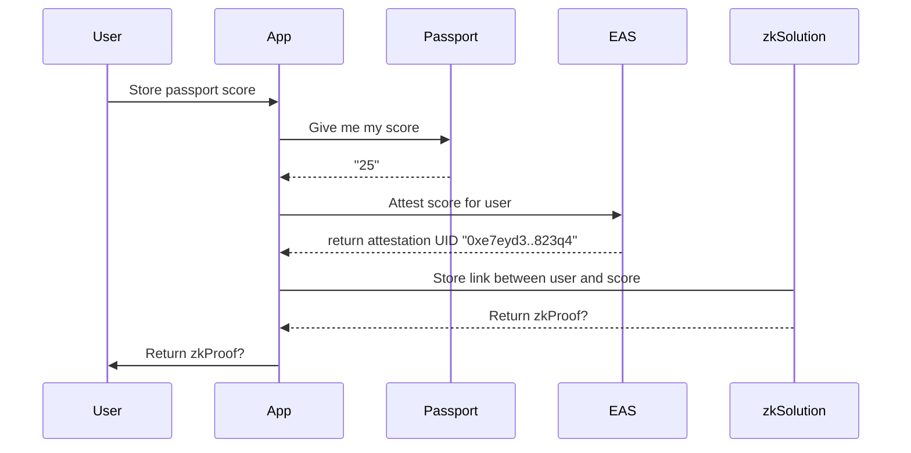
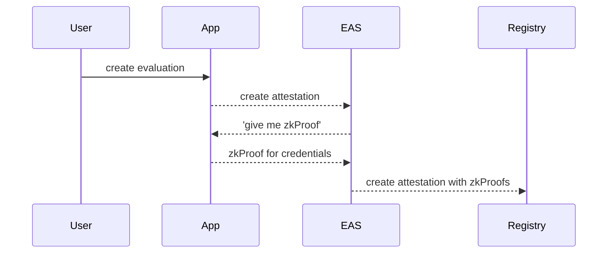
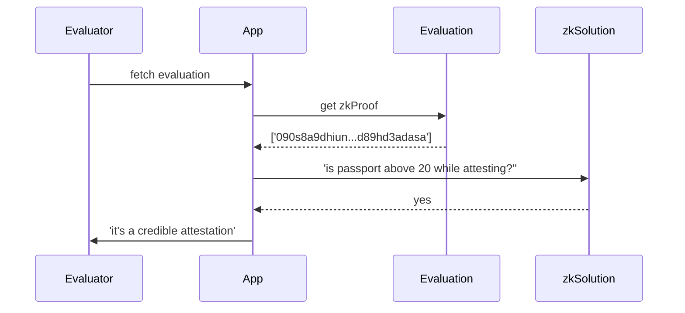

This is a [Next.js](https://nextjs.org/) project bootstrapped with [`create-next-app`](https://github.com/vercel/next.js/tree/canary/packages/create-next-app).

## Getting Started

First, run the development server:

```bash
npm run dev
# or
yarn dev
# or
pnpm dev
# or
bun dev
```

Open [http://localhost:3000](http://localhost:3000) with your browser to see the result.

You can start editing the page by modifying `app/page.tsx`. The page auto-updates as you edit the file.

This project uses [`next/font`](https://nextjs.org/docs/basic-features/font-optimization) to automatically optimize and load Inter, a custom Google Font.

## Features

##### Store credentials


##### Attach credentials for evaluation


##### Verify credentials of evaluator



## Future improvements

### Use TLSNotary to validate the authenticity of the data source

[TLSNotary](https://pse.dev/en/projects/tlsn)

### Obfuscate the attestor address by submitting proof to an anonymity set

[AnonKlub](https://docs.anonklub.xyz/docs/intro)? to verify the claim was created by a user in the anonymity set without revealing the attestor address.

### Implement in MetaLinks

[MetaLinks](https://meta-links.vercel.app/)

### Connect with hypercerts ecosystem 

Hypercerts are the cornerstone of an interconnected impact funding network. Impact claims, evaluations and funding are all linked to a hypercert. By providing anonymous evaluations, we can improve the validity of an impact claim and the funding is well spent.